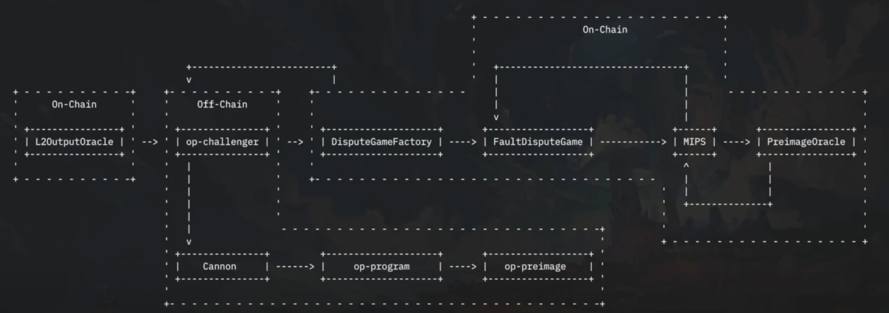
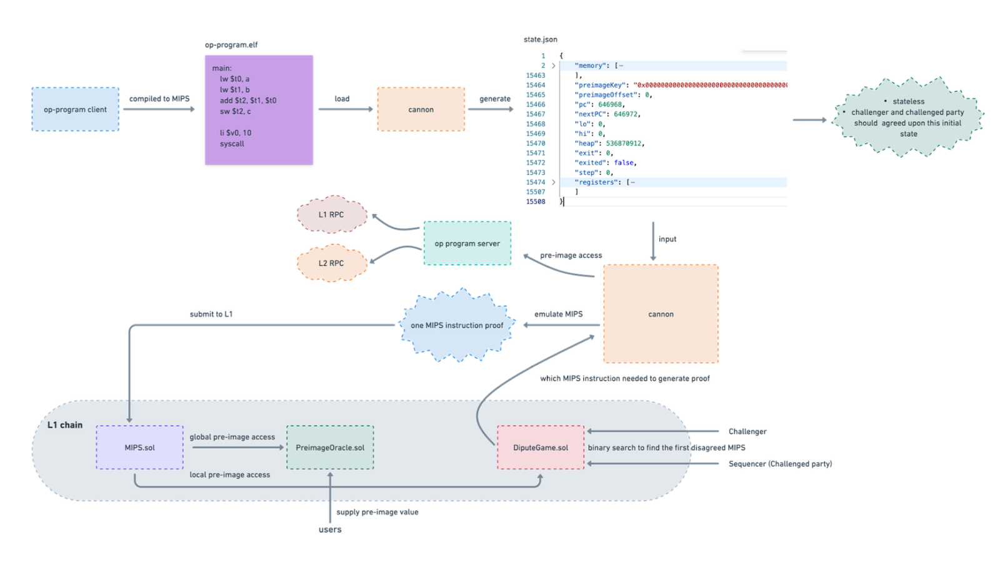

# OP Stack工作流程梳理

核心模块: `op-node`/`op-batcher`/`op-proposer`/`op-geth`/`op-challenger`。

## op-node工作流程

`op-node`主要做两件事，一个是[sequence](https://github.com/ethereum-optimism/optimism/blob/111f3f3a3a2881899662e53e0f1b2f845b188a38/op-node/rollup/driver/state.go#L269)，一个是[derive](https://github.com/ethereum-optimism/optimism/blob/111f3f3a3a2881899662e53e0f1b2f845b188a38/op-node/rollup/driver/state.go#L314)。

sequence对应L2出块，出完的块是unsafe状态，因为此时还没上L1。

derive是从L1区块推导出L2的区块和状态，这个阶段得出的L2区块状态会变成safe。如果对应的L1区块finalize了，得出的L2区块也会变成finalize。

### sequence

L2每2秒出一个块。

首先，找到一个锚定的L1区块，代码里叫[`L1Origin`](https://github.com/ethereum-optimism/optimism/blob/111f3f3a3a2881899662e53e0f1b2f845b188a38/op-node/rollup/driver/sequencer.go#L67)。锚定的L1区块，要么跟上个L2区块一样，要么是上个L2区块锚定区块的下一个块。

但必须满足：

$L2block.time \in [L1Origin.time, L1Origin.time+MaxSequencerDrift]$

主网`MaxSequencerDrift`是600秒。

其次，每个L2区块会包含一条[`锚定交易`](https://github.com/ethereum-optimism/optimism/blob/111f3f3a3a2881899662e53e0f1b2f845b188a38/op-node/rollup/derive/attributes.go#L103)，里面包含`L1Origin`的base fee等信息。

再其次，锚定同一个`L1Origin`的系列L2区块形成一个L2 Epoch。其中的第一个L2区块会包含`L1Origin`的[`deposit交易`](https://github.com/ethereum-optimism/optimism/blob/111f3f3a3a2881899662e53e0f1b2f845b188a38/op-node/rollup/derive/attributes.go#L70)。

最后，`op-node`会[调用](https://github.com/ethereum-optimism/optimism/blob/111f3f3a3a2881899662e53e0f1b2f845b188a38/op-node/rollup/driver/sequencer.go#L99)`op-geth`在`锚定交易`和`deposit交易`的基础上，打包L2本身的交易。

到这里，便是unsafe L2区块生成的主要过程。

### derive

derive过程和`op-batcher`发布上链的过程是逆过程，[工序](https://github.com/ethereum-optimism/optimism/blob/v1.1.4/specs/derivation.md#l2-chain-derivation-pipeline)非常繁多，`op-batcher`核心过程是: 先把系列L2区块聚合成`Channel`，再把`Channel`拆成多个`Frame`，最终发布上链的交易有可能包含多个不同`Channel`的`Frame`，也就是可能是乱序，因此又引入了一个`SequencerWindowSize`参数，大概是12小时，最终打包这笔交易的`L1InclusionBlock.number`必须不大于`L1Origin.number+SequencerWindowSize`，否则直接扔掉([singular batch](https://github.com/ethereum-optimism/optimism/blob/111f3f3a3a2881899662e53e0f1b2f845b188a38/op-node/rollup/derive/batches.go#L86)/[span batch](https://github.com/ethereum-optimism/optimism/blob/111f3f3a3a2881899662e53e0f1b2f845b188a38/op-node/rollup/derive/batches.go#L234))。

## op-batcher工作流程

`op-batcher`做的事情很单一：[获取](https://github.com/ethereum-optimism/optimism/blob/111f3f3a3a2881899662e53e0f1b2f845b188a38/op-batcher/batcher/driver.go#L256)上个L2 safe block之后的unsafe block，然后[提交](https://github.com/ethereum-optimism/optimism/blob/111f3f3a3a2881899662e53e0f1b2f845b188a38/op-batcher/batcher/driver.go#L265)到L1。

但是提交的工序如前所述，非常复杂。

## op-proposer工作流程

`op-proposer`负责往L1提交[output root](https://github.com/ethereum-optimism/optimism/blob/f09b8983409ecfa7ab2c76dc96e137bf182d7672/op-node/rollup/output_root.go#L13)。既可以[提交](https://github.com/ethereum-optimism/optimism/blob/f09b8983409ecfa7ab2c76dc96e137bf182d7672/op-proposer/proposer/driver.go#L419)到L1上的[`L2OutputOracle`](https://github.com/ethereum-optimism/optimism/blob/f09b8983409ecfa7ab2c76dc96e137bf182d7672/packages/contracts-bedrock/src/L1/L2OutputOracle.sol#L168)合约，也可以[提交](https://github.com/ethereum-optimism/optimism/blob/f09b8983409ecfa7ab2c76dc96e137bf182d7672/op-proposer/proposer/driver.go#L421)到[`DisputeGameFactory`](https://github.com/ethereum-optimism/optimism/blob/f09b8983409ecfa7ab2c76dc96e137bf182d7672/packages/contracts-bedrock/src/dispute/DisputeGameFactory.sol#L87)合约。

如果是提交到`L2OutputOracle`，先从该合约的[`nextBlockNumber`](https://github.com/ethereum-optimism/optimism/blob/f09b8983409ecfa7ab2c76dc96e137bf182d7672/packages/contracts-bedrock/src/L1/L2OutputOracle.sol#L286)获得下一个应该提交output root的L2区块高度，但是要等到这个高度finalize之后才会真的提交。

如果是提交到`DisputeGameFactory`，触发条件类似，只是需要质押`initBonds`，否则会[`revert`](https://github.com/ethereum-optimism/optimism/blob/f09b8983409ecfa7ab2c76dc96e137bf182d7672/packages/contracts-bedrock/src/dispute/DisputeGameFactory.sol#L103)。

## op-geth工作流程

类似eth 2.0的EL，由`op-node`通过[`engine api`](https://github.com/ethereum-optimism/optimism/blob/v1.1.4/specs/exec-engine.md#engine-api)驱动，并对用户提供l2 rpc服务(如`eth_sendRawTransaction`)。

## op-challenger工作流程

## 私网搭建

[Creating Your Own L2 Rollup Testnet](https://docs.optimism.io/builders/chain-operators/tutorials/create-l2-rollup)